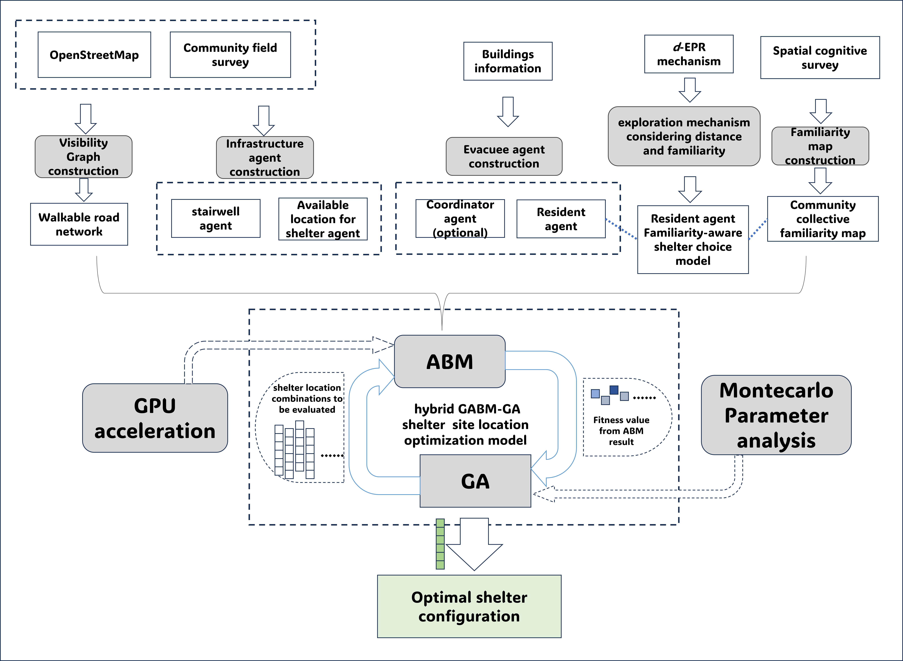
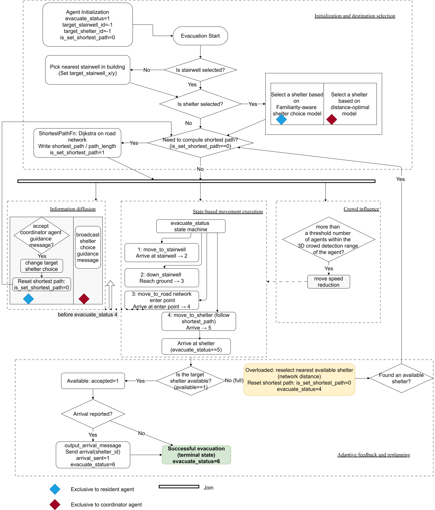
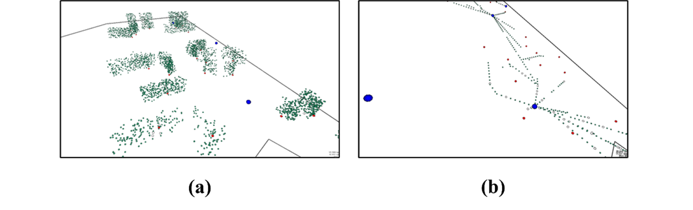

# Optimizing community‐scale shelter locations under behavioral uncertainty: A GPU accelerated agent‐based simulation-optimization approach

## Introduction

- This is a planning-support system for shelter optimization considering human behaviors.
- This project is built using FlameGPU framework.




## Prerequisites

The code has been successfully tested in the following environment.

All the used packages can be found in  [requirements.txt](requirements.txt).

- python (tested on 3.11.9)
- Windows or Linux with NVIDIA GPU
- CUDA
- [pyflamegpu](https://github.com/FLAMEGPU/FLAMEGPU2/releases), [version 2.0.0-rc](https://github.com/FLAMEGPU/FLAMEGPU2/releases/tag/v2.0.0-rc) (or higher), either built from source with whichever CUDA version you like, or download a pip wheel that matches your system


## GABM_simulation flowchart



## Getting Started

### Prepare your code


Clone this repo.
```bash
git git@github.com:ZHUOYUYUIO/Social-physical-system-shelter.git
```


### Quick start: simulation and optimization

1. Open `src/GABM_simulation_with_visualization.ipynb`.
2. In the first code cells, find the variable `project_root` and replace it with your local project directory, then run the notebook (execute all cells in order).
   - Example:
     ```python
     project_root = r"D:\path\to\Social-physical-system-shelter"
     os.chdir(project_root)
     ```
3. Open `src/GABM-GA_optimization_ver1.3_final.ipynb`.
4. Again, update `project_root` in that notebook to your local path, then run all cells to start the GA optimization.


### Additional: Try this framework with your own community data

1. Run `data_simulation_building_and_population/complete_workflow.py`.
2. Run `data_simulation_building_and_population/output/convert_boundary_coordinates.py`. You will obtain `boundary_coordinates_converted.py` for better visualization.
3. Configure the simulation environments, including: the road planning graph and the familiarity map.

#### Road planning graph (expanded visibility / shortest-path graph)
1. Ensure the following inputs exist under `data_simulation_building_and_population/output/`:
   - `transformed_buildings.geojson`
   - `transformed_stairwell.geojson`
   If you generated them via `data_simulation_building_and_population/complete_workflow.py`, note that it saves outputs to `data_simulation_building_and_population/data/output/` by default; you may need to copy/move the files from `data/output/` into `output/`.

2. Generate outstop points for stairwells (creates `stairwell_withoutput.geojson`):
   - `python data_simulation_building_and_population/env_data/stairwell_to_stop.py`

3. Index outstop points onto the visibility-graph node IDs (creates `stairwell_withoutput_new.geojson`):
   - `python data_simulation_building_and_population/env_data/index_outstop_stairwell.py`

4. Build the visibility graph and (optionally) expand it with stop nodes:
   - `python data_simulation_building_and_population/env_data/pipeline.py`

   This produces (at least) `expanded_visibility_graph_renumbered.json` in:
   - `data_simulation_building_and_population/env_data/`

5. Copy the road graph to the path used by the notebooks:
   - `data_simulation_building_and_population/env_data/expanded_visibility_graph_renumbered.json` -> `data/env_data/expanded_visibility_graph_renumbered.json`

#### Familiarity map
1. Generate the raw attraction map from familiar points:
   - `python data_simulation_building_and_population/env_data/familiarity_map_generation_from_geojson.py`

   This produces `attraction_matrix_familiar_points.json` (in the script folder):
   - `data_simulation_building_and_population/env_data/attraction_matrix_familiar_points.json`

2. Normalize it to `[0, 1]` (creates the normalized file expected by the notebook):
   - Make sure `data/env_data/attraction_matrix_familiar_points.json` exists (copy from step 1 if needed)
   - Then run:
     `python data_simulation_building_and_population/env_data/normalize_familiarity_map.py`

3. Verify the notebook-required outputs exist at:
   - `data/env_data/attraction_matrix_familiar_points.json`
   - `data/env_data/attraction_matrix_familiar_points_normalized.json`

Note: When applying the framework to a new community building layout, you must pay attention to the number of nodes used in the Dijkstra shortest-path computation and update them accordingly. Since the environment/graph structure cannot be changed frequently between GPU and CPU, the graph size (node count) must be fixed.

## screenshots for the visualization procedure



## Stay Tuned

More exciting developments coming soon!

Everyone is welcome to continue participating in the development, as we consider more complex behavioral mechanisms, such as evacuation dynamics of family and vulnerable groups.

## Citation
